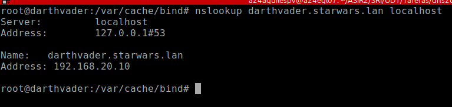
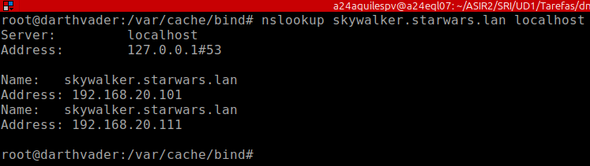
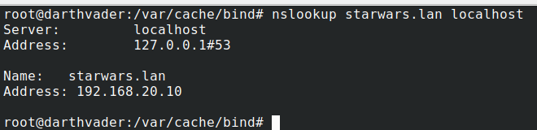
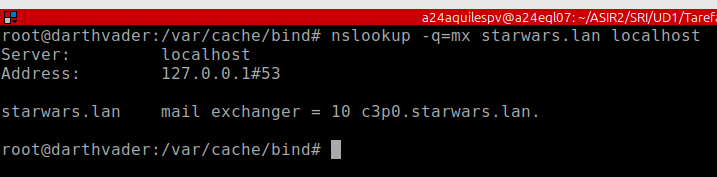
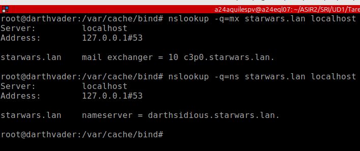
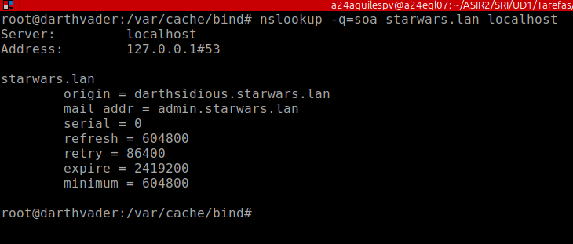
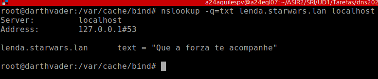
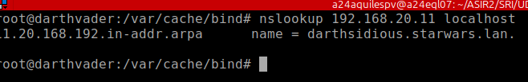

# Respuestas


## 1. Instala o servidor BIND9 no equipo darthvader. Comproba que xa funciona coma servidor DNS caché pegando no documento de entrega a saída deste comando dig @localhost www.edu.xunta.es

$~ dig @localhost www.edu.xunta.es

```dns
; <<>> DiG 9.20.11-4-Debian <<>> @localhost www.edu.xunta.es
; (2 servers found)
;; global options: +cmd
;; Got answer:
;; ->>HEADER<<- opcode: QUERY, status: NOERROR, id: 21307
;; flags: qr rd ra; QUERY: 1, ANSWER: 2, AUTHORITY: 0, ADDITIONAL: 1

;; OPT PSEUDOSECTION:
; EDNS: version: 0, flags:; udp: 1232
; COOKIE: aecd47d538a85b180100000068e4b99e1b711d3c08ad91e4 (good)
;; QUESTION SECTION:
;www.edu.xunta.es.              IN      A

;; ANSWER SECTION:
www.edu.xunta.es.       1783    IN      CNAME   edu.xunta.es.
edu.xunta.es.           27861   IN      A       85.91.64.65

;; Query time: 1 msec
;; SERVER: 127.0.0.1#53(localhost) (UDP)
;; WHEN: Tue Oct 07 06:56:30 UTC 2025
;; MSG SIZE  rcvd: 103
```

## 2. Configura o servidor BIND9 para que empregue como reenviador 8.8.8.8. pegando no documento de entrega contido do ficheiro /etc/bind/named.conf.options e a saída deste comando: dig @localhost www.mecd.gob.es 

**Fichero "named.conf.options":**

```js
options {
        directory "/var/cache/bind";
        forwarders {
                8.8.8.8;
        };

        listen-on {
                127.0.0.1;
                172.24.0.100;
        };

        listen-on-v6 {none;};
};
```

$~dig @localhost www.mecd.gob.es

```dns
; <<>> DiG 9.20.11-4-Debian <<>> @localhost www.mecd.gob.es
; (2 servers found)
;; global options: +cmd
;; Got answer:
;; ->>HEADER<<- opcode: QUERY, status: NOERROR, id: 46432
;; flags: qr rd ra ad; QUERY: 1, ANSWER: 1, AUTHORITY: 0, ADDITIONAL: 1

;; OPT PSEUDOSECTION:
; EDNS: version: 0, flags:; udp: 1232
; COOKIE: 5122445fd76654480100000068e4bac777d851b31a946e10 (good)
;; QUESTION SECTION:
;www.mecd.gob.es.               IN      A

www.mecd.gob.es.        21470   IN      A       212.128.114.116

;; Query time: 0 msec
;; SERVER: 127.0.0.1#53(localhost) (UDP)
;; WHEN: Tue Oct 07 07:01:27 UTC 2025
;; MSG SIZE  rcvd: 88
```

## 3. Instala unha zona primaria de resolución directa chamada "starwars.lan" e engade os seguintes rexistros de recursos (a maiores dos rexistros NS e SOA imprescindibles):

**Contenido del fichero de la zona "starwars.lan":**

```dns
;
; Zona directa para starwars.lan
;
$TTL    604800
@    IN    SOA    darthsidious.starwars.lan. admin.starwars.lan. (
                  0        ; Serial
             604800        ; Refresh
              86400        ; Retry
            2419200        ; Expire
             604800 )    ; Negative Cache TTL
;
@    IN    NS    darthsidious.starwars.lan.
starwars.lan.    IN  A 192.168.20.10 
darthvader  IN  A   192.168.20.10
darthsidious    IN  A   192.168.20.11
skywalker   IN  A   192.168.20.101
skywalker   IN  A   192.168.20.111
luke    IN  A   192.168.20.22
yoda    IN  A   192.168.20.24
yoda    IN  A   192.168.20.25
c3p0    IN  A   192.168.20.26
palpatine   IN  CNAME   darthsidious.starwars.lan.
@   IN  MX  10  c3p0.starwars.lan.
lenda   IN TXT "Que a forza te acompanhe"
```

## 4. Instala unha zona de resolución inversa que teña que ver co enderezo do equipo darthvader, e engade rexistros PTR para os rexistros tipo A do exercicio anterior. Pega no documento de entrega o contido do arquivo de zona, e do arquivo /etc/bind/named.conf.local

**Fichero de la zona de resolución inversa "20.168.192":**

```dns
;
; Zona de búsqueda inversa para 
; IPs de la subred 192.168.20.0/24
;
$TTL    604800
@    IN    SOA    darthsidious.starwars.lan. admin.starwars.lan. (
                  0        ; Serial
             604800        ; Refresh
              86400        ; Retry
            2419200        ; Expire
             604800 )    ; Negative Cache TTL
;
@    IN    NS    darthsidious.starwars.lan.
10  IN  PTR darthvader.starwars.lan.
11  IN  PTR darthsidious.starwars.lan.
22  IN  PTR luke.starwars.lan.
24  IN  PTR yoda.starwars.lan.
25  IN  PTR yoda.starwars.lan.
26  IN  PTR c3p0.starwars.lan.
101  IN  PTR skywalker.starwars.lan.
111  IN  PTR skywalker.starwars.lan.
```


**Fichero "named.conf.local":**

```js
//
// Do any local configuration here
//

zone "starwars.lan" {
	type master;
	file "/etc/bind/db.starwars.lan";
};

zone "20.168.192.in-addr.arpa" {
	type master;
	file "/etc/bind/db.20.168.192";
};
```

## 5. Comproba que podes resolver os distintos rexistros de recursos. Pega no documento de entrega a saída dos comandos:

###### nslookup darthvader.starwars.lan localhost

```
Server:         localhost
Address:        127.0.0.1#53

Name:   darthvader.starwars.lan
Address: 192.168.20.10
```




###### nslookup skywalker.starwars.lan localhost

```
Server:         localhost
Address:        127.0.0.1#53

Name:   skywalker.starwars.lan
Address: 192.168.20.101
Name:   skywalker.starwars.lan
Address: 192.168.20.111
```




###### nslookup starwars.lan localhost

```
Server:         localhost
Address:        127.0.0.1#53

Name:   starwars.lan
Address: 192.168.20.10
```




###### nslookup -q=mx starwars.lan localhost

```
Server:         localhost
Address:        127.0.0.1#53

starwars.lan    mail exchanger = 10 c3p0.starwars.lan.
```




###### nslookup -q=ns starwars.lan localhost

Server:         localhost
Address:        127.0.0.1#53

starwars.lan    nameserver = darthsidious.starwars.lan.




###### nslookup -q=soa starwars.lan localhost

```
Server:         localhost
Address:        127.0.0.1#53

starwars.lan
        origin = darthsidious.starwars.lan
        mail addr = admin.starwars.lan
        serial = 0
        refresh = 604800
        retry = 86400
        expire = 2419200
        minimum = 604800
```




###### nslookup -q=txt lenda.starwars.lan localhost

```
Server:         localhost
Address:        127.0.0.1#53

lenda.starwars.lan      text = "Que a forza te acompanhe"
```




###### nslookup 192.168.20.11 localhost

```
11.20.168.192.in-addr.arpa      name = darthsidious.starwars.lan.
```


