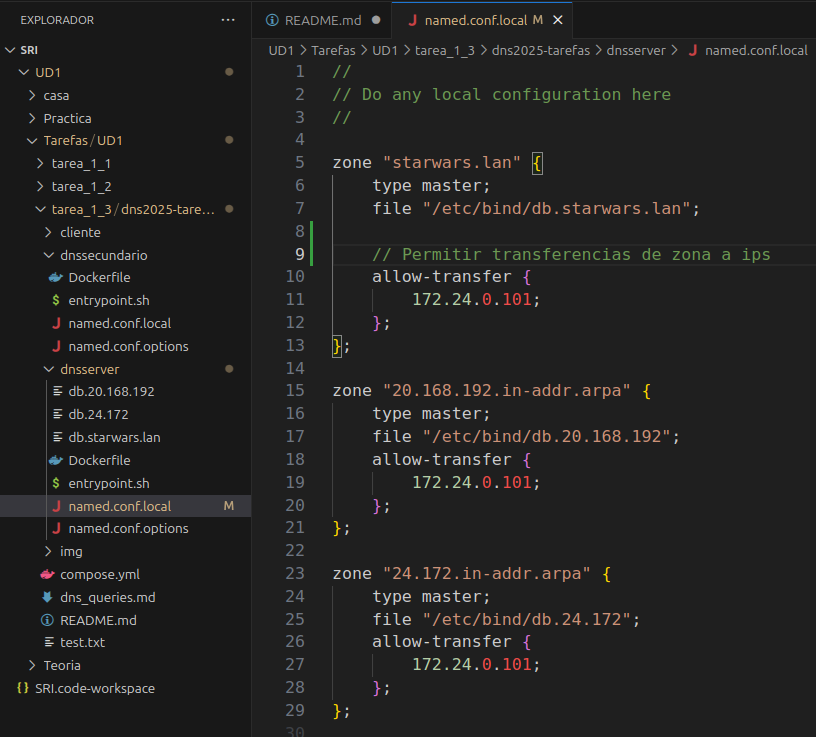

# Respuestas Tarefa 1.3: Instalación de zonas secundarias

## 1. Configuración de ambos servidores y mostrar logs de la transferencia de zona

###### **- Darthvader: named.conf.local**

###### **- Darthsidious: named.conf.local**

###### **- Transferencias de zona**

- Al recargar las zonas: `$ rndc reload`

- Forzar tansferencia de zona: `$ dig axfr starwars.lan @172.24.0.100`

