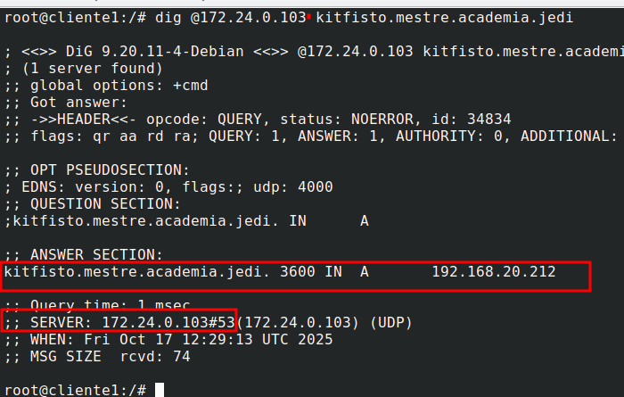

# Respuestas Tarefa 1.5: Subdominios

## 1. Resolver desde un cliente los siguientes nombres de dominio

**- Subdominio virutal configurado**

**- Resolver subdominio virtual kitfisto**
###### root@cliente1:/# dig @172.24.0.103 kitfisto.mestre.Cademia.jedi

- Resolver subdominio virtual macewindu
###### root@cliente1:/# dig @172.24.0.103 macewindu.mestre.academia.jedi

