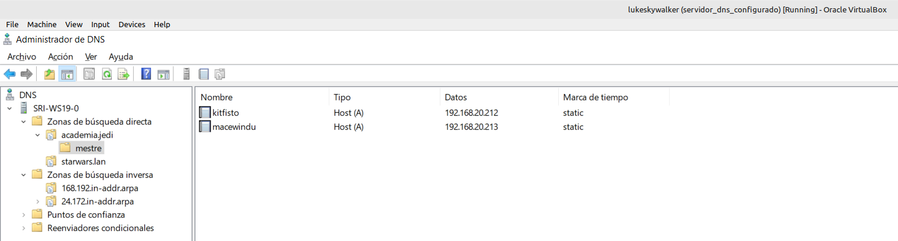
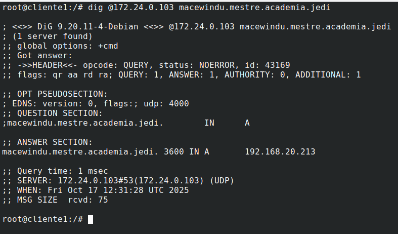
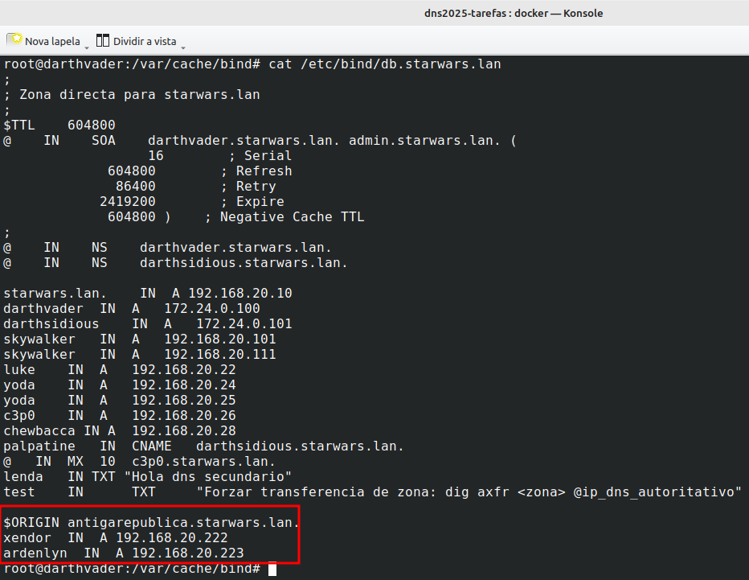
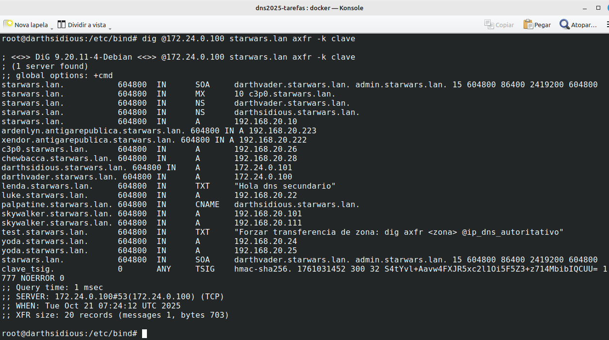
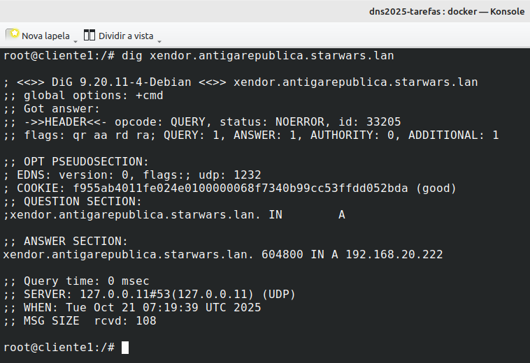
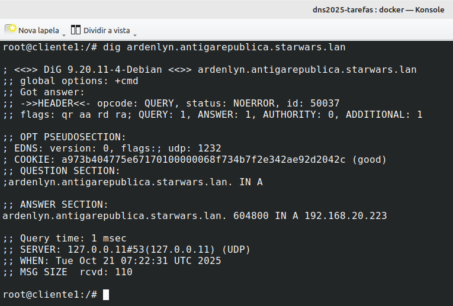

# Respuestas Tarefa 1.5: Subdominios

## 1. Resolver desde un cliente los siguientes nombres de dominio

**- Subdominio virtual configurado**

**- Resolver subdominio virtual kitfisto**
###### root@cliente1:/# dig @172.24.0.103 kitfisto.mestre.Cademia.jedi

**- Resolver subdominio virtual macewindu**
###### root@cliente1:/# dig @172.24.0.103 macewindu.mestre.academia.jedi

## 2.Instala no equipo darthvader un subdominio chamado antigarepublica, e nel os rexistros:

**- Subdominio virtual antigarepublica**

**- Contenido replicado en darhtsidious**

**- Resolver xendor**

**- Resolver ardenlyn**

ESTO NO VA AQUI
NO BORRAR

