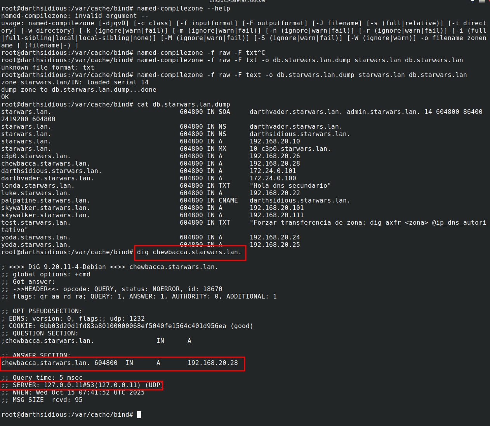

# Respuestas Tarefa 1.3: Instalación de zonas secundarias

## 1. Configuración de ambos servidores y mostrar logs de la transferencia de zona

###### **- Darthvader: named.conf.local**

###### **- Darthsidious: named.conf.local**

###### **- Transferencias de zona**

- Al recargar las zonas: `$ rndc reload`

- Forzar tansferencia de zona: `$ dig axfr starwars.lan @172.24.0.100`

## 2. Transferencia de zona la reiniciar y registro de chewbacca.starwars.lan

###### **- Transferencia de zona al reiniciar los contenedores**

###### **- Fichero de la zona db.starwars.lan en el darthsidious**

## 3. Comprobar que el darhtsidous puede resolver el nuevo chewbacca.starwars.lan
- $ dig chewbacca.starwars.lan

## 4. Lo mismo que el apartado 2, pero ahora usando una clave TSIG

###### **- Transferencia de zona al reiniciar los contenedores**

###### **- Fichero de la zona db.starwars.lan en el darthsidious**
